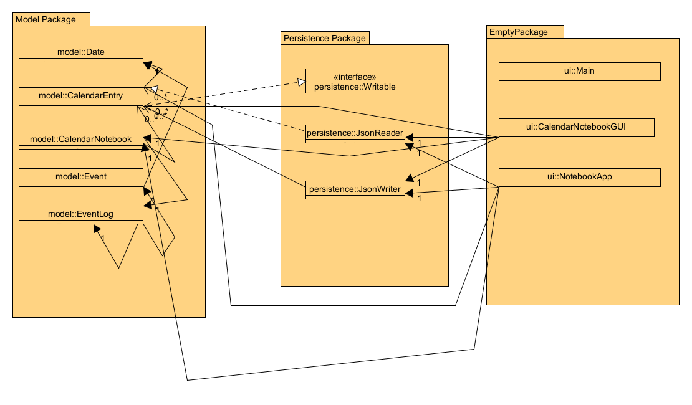

# Calendar Notebook Project

## *Proposal*
The application is a Java-Swng based application of the calendar notebook, calendar notebook with basic browsing and date modification functions . The notebook has basic functions such as input, save, delete, view and so on.

With the development of society, more and more people rely on laptops to work and live especially college students. This means that it is not convenient to make records on paper calendars to carry around, nor is it convenient to change and manage them in time. Given that the laptop as an electronic tool that most college students carry with them on a daily basis and the default application of the computer does not exist to combine the calendar and notepad, the calendar notebook application can help college students or experimental staff to combine the date to record logs or manage schedules and memos. I made this project because I was working on my laptop and I wanted to see the calendar but I couldn't see the schedule or timetable for that date, and the only way to do that was to use an online tool such as Google Calendar, which can't be done with a local offline tool. I wanted to implement this feature through Java and that's why I developed this application.

# *User Stories* 
- As a **user**, I would like to be able to enter the contents of a record on any given date. 
- As a **user**, I would like to be able to view what was recorded on any date for a particular date. 
- As a **user**, I want to be able to delete contents of a record for a certain date 
- As a **user**, I want to be able to quit the notebook.
- As a **user**, I want all the records to be saved as a local file 
- As a **user**, when I select the quit option from the application menu, I want to be reminded to save my log to file and have the option to do so or not.
- As a **user**, I want to be able to be reminded to load my Entry to file and have the option to do so or not when I open the notebook.
- As a **user**, I want to be able to view all the entries with dates in the notebook.
- As a **user**, I want to be able to clear all text content I entered if I don't want it.

# *Instructions for Grader*
- You can enter the date(dd/mm/yyyy format, ”/“ are impotent) you want to add and the content of the entry by type in the date and content in the boxes on the Control panel
- You can then click Add Entry Button to complete the process of adding the entry to the date (multiple entries can be entered for one date).
- You can receive feedback from the application when you open it, exit it, save it, reload it, and these feedbacks include images. the logo of the app located at the top of the application, the logo Universal Searcher logo located at top of the Universal Searcher panel.
- You can save all current entries to a local json file by clicking on the Save Button in the Control panel.
- You can reload the local json file to restore the notebook to the last saved state by clicking on the Load Button in the Control panel.
- You can retrieve relevant entries in the Notebook by typing the date or content in the universal searcher input box and clicking the Search button.
- You can delete an entry from the notebook by clicking the delete button next to each entry.
- You can click the Clear button to clear the date entry box, the content entry box, and the Universal searcher.
- You can click the Quit button to exit the App.

# *Phase 4: Task 2*
Event Log:
Fri Apr 05 00:08:19 PDT 2024
Entry "United States of America First Day" added to 3/9/1783

Fri Apr 05 00:08:50 PDT 2024
Entry "66666666" added to 5/4/2024

Fri Apr 05 00:08:54 PDT 2024
Entry "66666666" deleted from 5/4/2024

Fri Apr 05 00:08:54 PDT 2024
Searched for "" and found 5 entries.

Fri Apr 05 00:09:00 PDT 2024
Searched for "666" and found 0 entries.

Fri Apr 05 00:09:15 PDT 2024
Searched for "all" and found 1 entries.

Process finished with exit code 0

This shows a sample event log when you log out of My Calendar Notebook App. It shows logs being added and deleted, and when you use Universal Searcher. 
If the user chooses to load the local file, then all entries in the file are added at the same second.
When a user deletes an entry the Universal Searcher will re-search the entry to achieve full synchronisation, so something like Fri Apr 05 00:08:54 PDT 2024
Searched for "" and found 5 entries will appear.

# *Phase 4: Task 3*
Looking back at my project, I think I handled cohesion and coupling well in the design. I think that if I were to
refactor my code, I would like to create methods to consolidate duplicate code and fragmented code in the GUI (new ideas 
are always randomly appearing, resulting in an uneven distribution), thus refactoring my application and making it easier
to read and maintain for future.